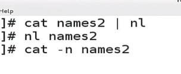

if you dont have you parent directory you can make it with this command :

```
mkdir "-p" /root/1400/tir ......
```

shows the tree of directories:

```
tree
(sudo apt install tree)
```

if you are not the root user and you want to be root :

```
sudo -i
```

the mkdir in ubonto is only work in other user with command if `sudo`

the second way to make a file :

```
pwd > file
```

the`>` or `>>` making files

`file` command shows the type your file

for copying files:

```
cp 'origin'  'destination'
```

three ways of copying file

:

For moving files to another path :
```
mv 'origin'  'destination'
```

There is three ways of moveing file :


1-rename
2-move
3-move + rename

for deleting two charactes files:

```
rm -f ??
```

For making a file have number in every line we can do in three ways :



removing every file with specific character :

```
rm -f z* ---> every file with z
```

copying the directory itself:

```
cp -r
```

`rmdir` only delete empty directories

`rm` only delete files

`rm -rf`delete all of directories includong files

this command make a copy of you command and everytime you can use it with pk :

```
alias pk='your command'
```

`ll` = `ls -l`
