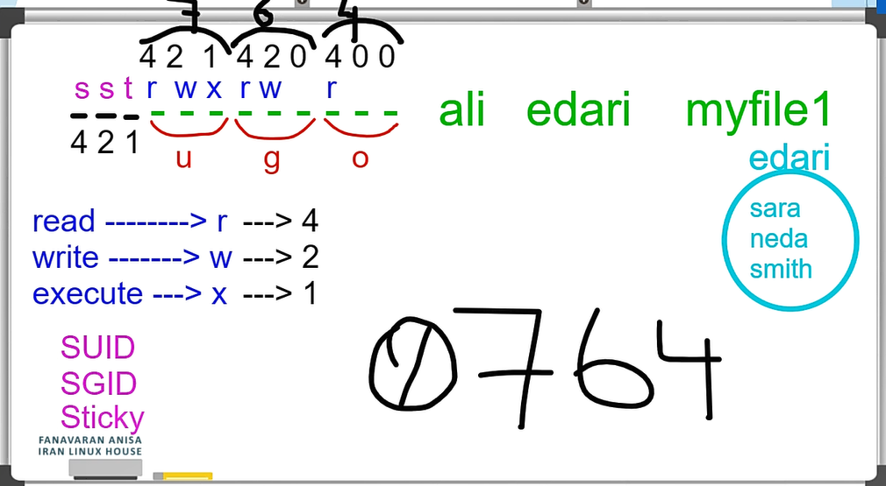

Swap : one partition that it's helper when ram doesnt have enough space and its a virtual memory (in windows is page file).  
The Least recently used one goes to the swap(LRU)

swap doesn't have mount point!

swap space doesnt have a static space of memory (based on your needs)

if we had LVM we could change the swap space and make it bigger inside our partition

`free -h` you can see the swap space

`lsblk` is to see the partition tree

You can connect the two swao from twwi diffrent memory and connected to each other but the performance is gonna be a little weaker for the kernel!

for swapping instead of `mkfs` we use `mkswap` for formating

in swap we dont have mounting we have adding to system swap with `swapon` anf `swapoff`

For seeing the swap partition use :`free -h`

Steps:


1- make a new partition  
2- change the partition to swap type with `t` adn Hexcode(82 for swap) of partition in fdisk  
3- use `mkswap` and then use `swapon`

With this command you can make swap from another partition :
if : input file  
of : output file  
bs : block size  
The zero file gets the zeroes and puts them into the swap as much as we want

```
dd  if=/dev/zero of=/root/myswap bs=500M count=1
```

Then format it with `mkswap /root/myswap`  
Then add it to our swap file with `swapon /root/myswap`

With catting the /proc you can easily see the swap places : `cat /proc/swaps`

more less partition for swap is better for ourselfs.

`cat /proc/meminfo` gives ram information

`uname -r` version of kernel

To see the sizes of /var and directories all below this: (for example)

```
du -csh /var
```

Permisions of files:
first letter of word is for type of file we dont care!  
we seprate the line every three words:


The logice and most things that we saw in the sites:

more you go the permitions goes less

For root user the things that he can do or what permision that he has is two diffrent things (his power is from somewhere else)

Commands :  
`chmode` is for changing permosions

`chown` is for changing owner (ali)

`chgrp` is for changing the group

`mv` is for changing the file


Type of files:
you can see with command of `file`
c = character special device

The ways to change the chmode :


for changing the directory and below files you give like this :

```
chmod  -R 700 mydir1
```

changing the owner : `chown reza myfile1`

changing the group : `chown  :IT myfile1` (: make change the group)

Or : `chgrp IT myfile1`

both : `chgrp reza:IT myfile1`

for all reza and IT :`chown -R reza:IT mydir1`

For file : `mv + old name + new name`


exampl: 
```
chmod 640 f?
chmod o-r f?
```
```
chgrp developers f1
chown root:developers f1
chown :developers f1
```


 Note 1: Why is default SWAP priority -2?
In Linux, if no priority is specified when enabling swap, the kernel assigns a default priority of -2.
The value -1 is typically reserved for internal or special purposes (like "disabled" or "error states").
That’s why regular swap devices or files start from -2, -3, etc., unless the user manually sets a higher (positive) priority.

 Note 2: Why is a 500 MB SWAP shown as 511996 KB?
Swap size in /proc/swaps is shown in kilobytes (KB).
Since 1 MB = 1024 KB, then 500 × 1024 = 512000 KB.
If the swap is a partition, a small portion may be reserved or lost due to alignment or metadata, so you might see something like 511996 KB, which is still approximately 500 MB.

swapon is a command used to enable swap space on a device or file.
It activates the specified swap area so the system can start using it for virtual memory.
You normally use swapon after creating a swap partition or file — but if it's listed in /etc/fstab, it will be activated automatically at boot, and you won't need to run swapon manually.

