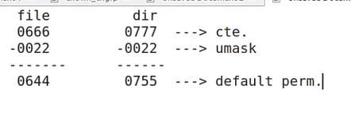
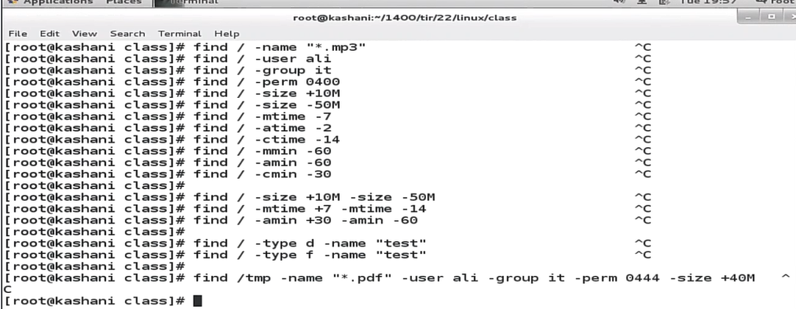

Some example of editing permisions:


With command of `stat + file name ` you can see the file history

For making a group you can use `groupadd` command line

`umask` if you call it show you how much did we reduce the 0666 for files and how much did we reduce from dir 0777 to give the default permisions.


Links:
1- hard link (link)
2- symbolic link (sym link)

To make sym link:

```
ln -s file_asli link_name
```

doesn't have data inside the link.
permision to links of sym link is 777.
we can make a chain link of sym links and if one of them disconnect the chain is broken

If you want to your link work only in a specific way you have to give the link absolute path , o.w. your link goona work in same name in other path!

The sym link is not backup of data and the link is gonnahave a problem if the address changes.

You can use sym links as a shourtcut to the one link with connected files.

For finding things you can use `find` for finding a directory , user, ....  
Examles:

(for the One left to the end normaly `-` is for files but here for filtering with type you have to use `f`).

The command of `-exec + order \;` it meant go do it:

```
-exec rm rf {} \;
```

IF you add `\` to your file name you can make the file name with space:
```
mkdir my\ directory ----> file name: my directory
```

Hard links : 
````
ln fiel_mojod link_name
````
it means a logical name to a physycal file
connected to inode directly.
they must be in one partition.
They are backups. if one of them changes all of them changes.

with `-inum + inode` you can filter inodes with find command


"When we create the user 'farid', a group named 'farid' is automatically created as well, so there is no need to create it manually."

find / -samefile namefile : Searches the entire filesystem (/) to find hard links that point to the same inode as namefile. 

```
find / -samefile namefile -print 2> /dev/null
find / -inum inode -print 2> /dev/null
```

```
Hard links are actual copies pointing to the same inode, so they act like backups in the same filesystem.
Symbolic links (symlinks) are references (shortcuts) and can span across different partitions.
```

