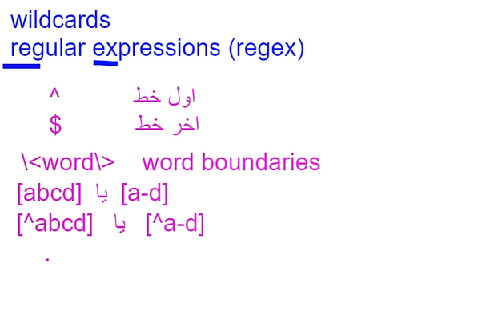
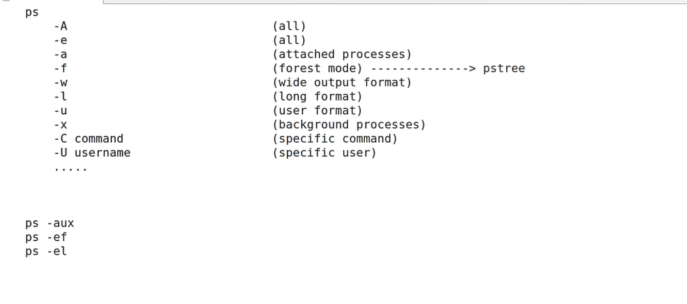

`uniq` command delete the Repetitive lines

`join` connect two file to each other you need the common column

`paste` join the files without the common columns

`split` this command cut the lines (default 1000 line):

```
split -5 users.txt /opt/u_
split -b  4.5G bsckup bck_
```

with `cat` you can concatenate two files(join it)

`tac` is reversing the lines and show it

`rev` is reversing the char in every lines and show it

`xargs` show the file in one line

`tee` show monitor and put it in the file
or next command and file

_grep_:  
with `-v`switch and grep you can filter that lines who doesnt have this  
`-c` count the lines  
`-n` show witch line  
`-i` case sensetive

with `'^word$'`you can look for the word that at the end or start of the line

The ^ inside the beraket shows that they are not in the beraket.


PS commands switches:


first app after loading kernel is memory is init(in new versions systemd, process 0 and PID of that is 1 )

`top` shows the info aboout process of your linux (with q you can quite)

`uptime` is for info about the login of linux and the users number

with `which top` you can see the place of permisions for top and change the permisions. for example you can change the others permision and remove the x permision.


```
Start with p: cat names | grep '^p'
End with d: cat names | grep 'd$'
Lines from the nams file that contain Ali are independent: cat names | grep '\<ali\>'
Lines with dots inside them: cat names | grep '\.'
```
