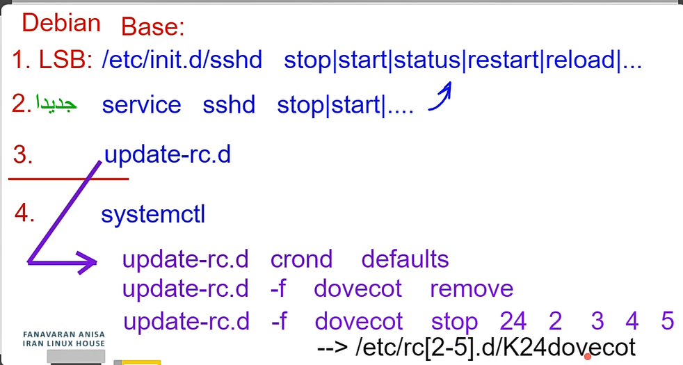
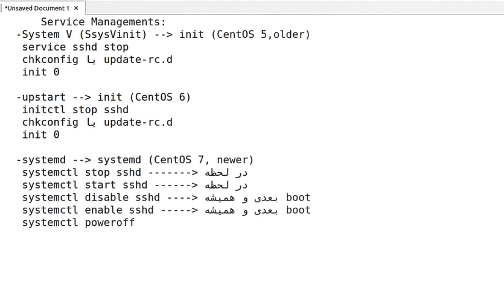
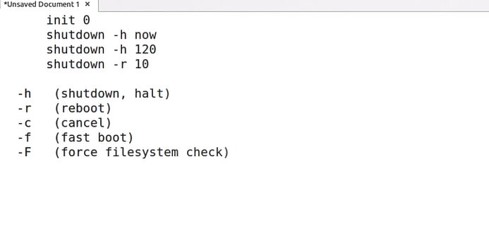
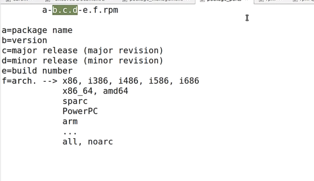

for sshd service : 
```
service sshd start 
service sshd stop 
service sshd restart 
service sshd status 
service sshd reload
...
``` 
Some ways to connect to service: 

with chkconfig you can see the hole servers

for debian base linux:



Services managment:


Some switches : 


`gzip` or `bzip2` zipe the files

`gzip -d` or `gunzip` unzipe the files

with this`gzcat`or `zcat` app you can see inside of the zip file

tar is a tool to archive the files together:(copies of files)

example:
```
tar -cvf ./goni.tar ./m*
```
with `-g` you  can zip and unzip the files with gzip and with `-j` you can zip and unzip the files with bzip2
```
tar -czf gooni.tar.gz ./m* ----> for zipping the files
tar -zxf gooni.tar.gz  ----> for unzipping the files
The bzip2 :
tar -cjf gooni.tar.gz  ----> for zipping the files
tar -jxf gooni.tar.gz  ----> for unzipping the files
```

Package Management:


package explenation: 


Installing with rpm :
