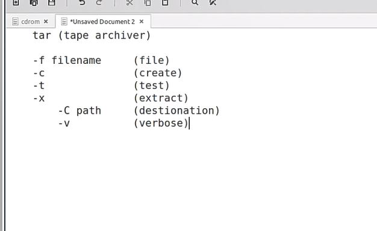
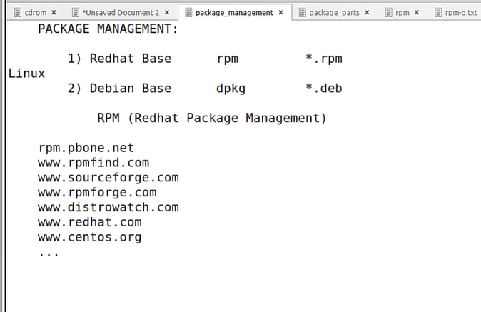
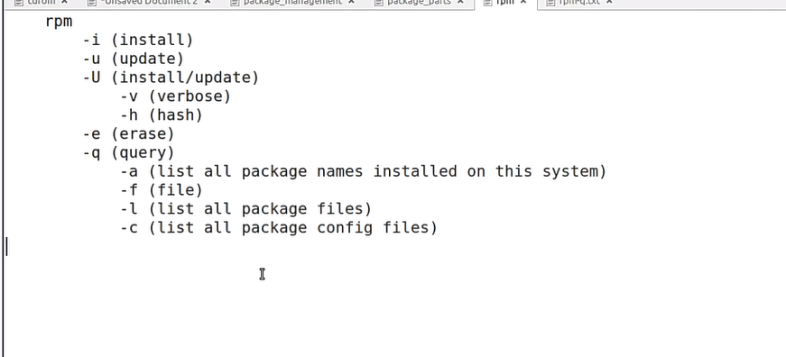
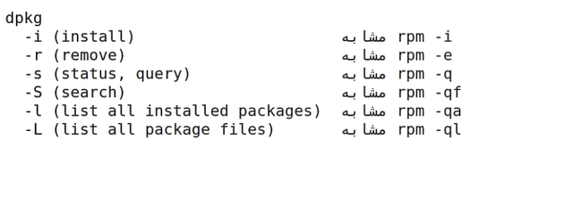
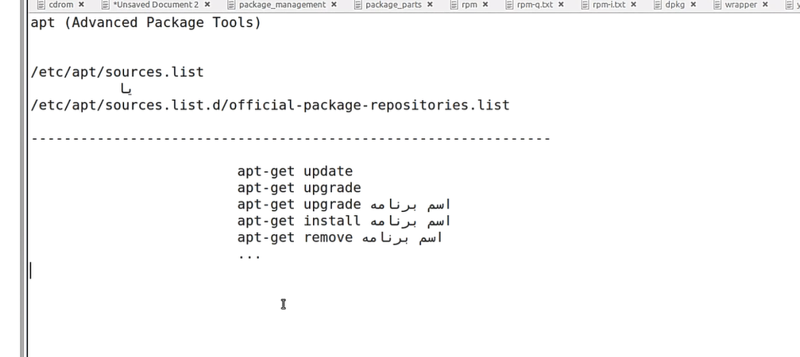
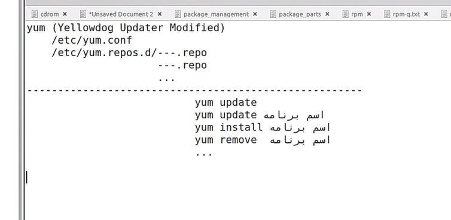

for sshd service : 
```
service sshd start 
service sshd stop 
service sshd restart 
service sshd status 
service sshd reload
...
``` 
Some ways to connect to service: 

with chkconfig you can see the hole servers

for debian base linux:


Services managment:


Some switches : 


`gzip` or `bzip2` zipe the files

`gzip -d` or `gunzip` unzipe the files

with this`gzcat`or `zcat` app you can see inside of the zip file

tar is a tool to archive the files together:(copies of files)

example:
```
tar -cvf ./goni.tar ./m*
```
with `-g` you  can zip and unzip the files with gzip and with `-j` you can zip and unzip the files with bzip2
```
tar -czf gooni.tar.gz ./m* ----> for zipping the files
tar -zxf gooni.tar.gz  ----> for unzipping the files
The bzip2 :
tar -cjf gooni.tar.gz  ----> for zipping the files
tar -jxf gooni.tar.gz  ----> for unzipping the files
```

Package Management:


package explenation: 


Installing with rpm :


`uname -r` show the kernel version

`rpm -q -a` ahowing all the packages `|sort` for sorting them

`wc -l` show the last number of lines
```
time cat messages | wc -l ---> showing the time of that
```
`ifconfig` you can see your IP address

`-i` for grep you can make it case sensetive 

for connecting to another Ip for e.:
```
ssh pouya@192.168.8.100 
```


for finding the package of random app :
```
rpm -qa | grep -i "ssh" ---> findong the ssh for e.
```
another way (main way):
```
rpm -qf /usr/bin/"firefox" ---> finding firefox for e.
```
for finding the path of that firefox use `which` 

fro seeing the config file of that `-c` and `-l` for all the files:
```
rpm -ql 
rpm -qc
```

for deleting the packages :
```
rpm -e 
```
in `rpm.pbone.net` you can find the packages that you need

If you want to download it with command line you can use the link address and `wget` command :
```
wget "link address" 
```
`-ivh` installing and show the installation

dpkg commands :(like rpm)


apt commands :(debian)


yum commands :(redhat)


apt installation commands:
